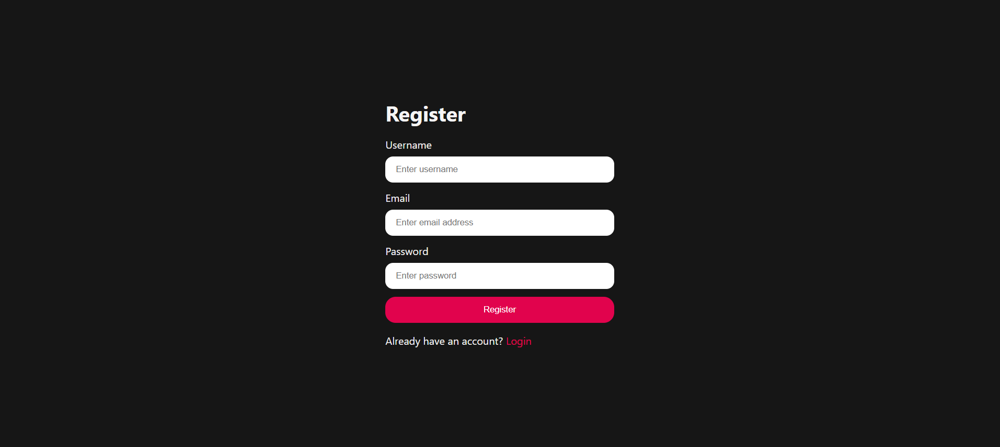
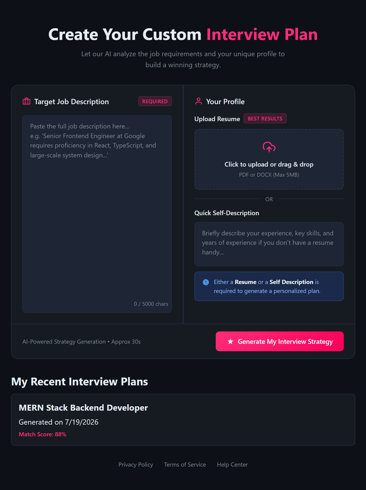
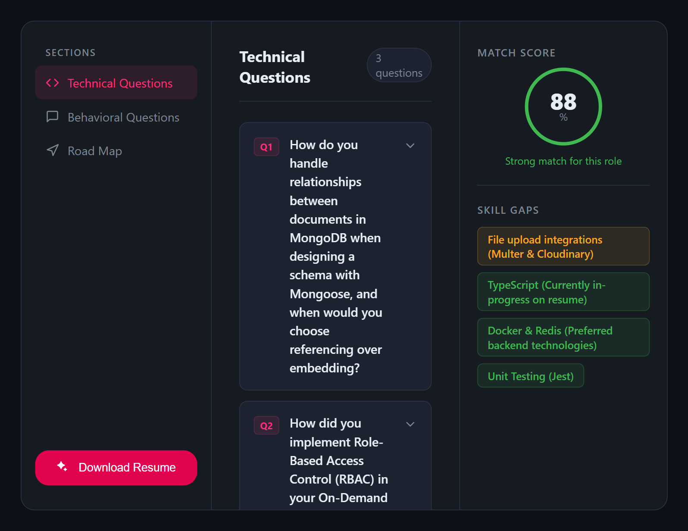
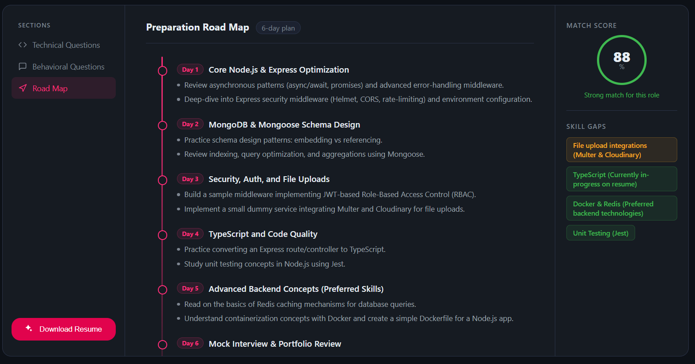
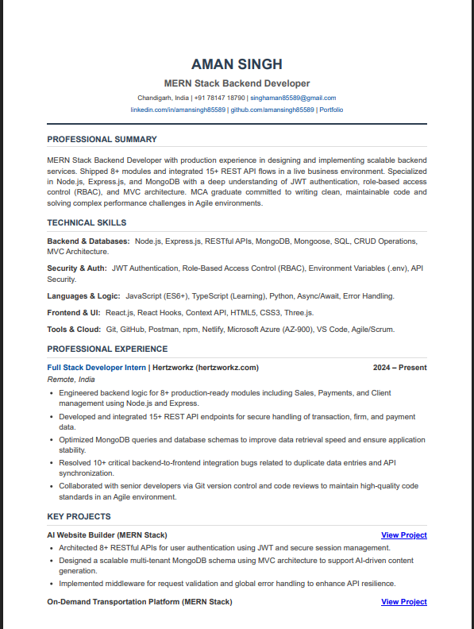
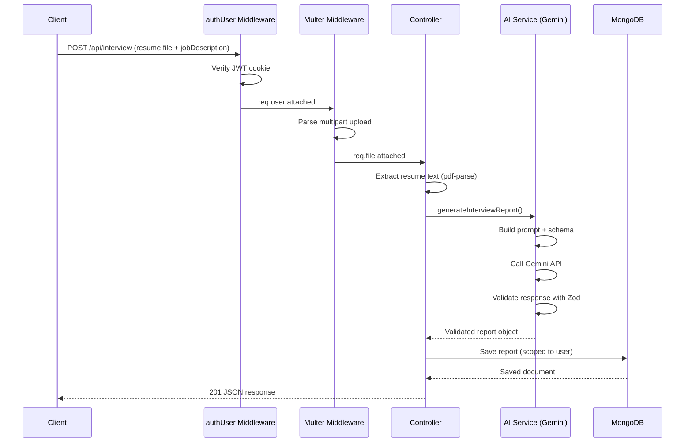
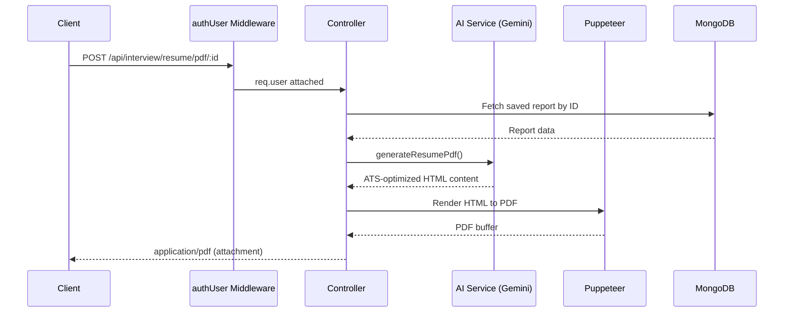

# AI Job Prep — Gen AI Job Preparation Platform


A production-ready full stack web application that helps job seekers prepare for their next role using generative AI. Users upload a resume and a job description, and the platform analyzes skill gaps, generates a personalized interview report (technical + behavioural questions with a preparation plan), and produces an ATS-optimized resume — exportable as a downloadable PDF.

---

## Table of Contents

- [Overview](#-overview)
- [Screenshots](#-screenshots)
- [Core Tech Stack](#-core-tech-stack)
- [Key Features](#-key-features)
- [Architecture](#-architecture)
- [Database Schema](#-database-schema)
- [Getting Started](#-getting-started)
- [Environment Variables](#-environment-variables)
- [API Reference](#-api-reference)
- [Roadmap](#-roadmap)

---

## Overview

AI Job Prep bridges the gap between a candidate's resume and a target job description. Instead of guessing what to prepare for, users get:

- A structured, AI-generated breakdown of how well their resume matches a job description
- Ranked missing skills
- Likely technical and behavioural interview questions
- A short, actionable preparation plan
- An ATS-optimized resume, rendered server-side and downloadable as a PDF

The app is a secure, authenticated multi-user platform — every interview report and resume PDF is scoped to the logged-in user via JWT-based auth with cookie sessions and token blacklisting on logout.

---

## 📸 Screenshots

> Add your screenshots to a `docs/screenshots/` folder in the repo, then reference them below. GitHub renders these automatically once pushed.

| Login / Register | Dashboard |
|---|---|
|  |  |

| Resume Upload & Analysis | Interview Report |
|---|---|
|  |  |

| ATS Resume PDF Output |
|---|
|  |


## 🛠 Core Tech Stack

| Layer | Technology | Purpose |
|---|---|---|
| Frontend | React.js, Vite | UI and build tooling |
| Frontend | Axios | API communication |
| Frontend | Tailwind CSS | Styling |
| Backend | Node.js, Express.js (CommonJS) | Server & routing |
| Database | MongoDB Atlas + Mongoose | Persistent storage |
| Auth | JWT (cookie-based) | Session management |
| Auth | Token Blacklist Model | Invalidate tokens on logout |
| AI | Google Gemini API (`@google/genai`) | Resume/JD analysis, report generation |
| Validation | Zod | Runtime validation of AI output |
| File Upload | Multer (in-memory) | Resume PDF ingestion |
| Text Extraction | `pdf-parse` | PDF → plain text |
| PDF Generation | Puppeteer | HTML → downloadable PDF |
| Password Security | bcryptjs | Password hashing |

---

## ✨ Key Features

### 🔐 Secure Authentication
- Register / login with hashed passwords (`bcryptjs`)
- JWT issued on register/login, stored in an HTTP cookie
- Logout blacklists the token so it can't be reused even if intercepted
- `authUser` middleware protects all interview and resume routes

### 🤖 AI-Powered Resume & Interview Analysis
- User uploads a resume PDF + provides a job description (self description optional)
- Resume text is extracted server-side (`pdf-parse`) before ever reaching the AI service
- Gemini compares resume, job description, and self description using a schema-constrained prompt — the model's output shape is enforced at generation time, then re-validated with Zod before it's trusted or saved

| Output | Description |
|---|---|
| Overall Score | ATS match score, 0–100 |
| Strengths / Weaknesses | Short AI-generated summary |
| Skill Gaps | Ranked by importance (High / Medium / Low) |
| Technical Questions | Generated from resume + JD context |
| Behavioural Questions | Generated from resume + JD context |
| Preparation Plan | Multi-day, task-based plan |

### 📄 On-Demand Resume PDF Generation
- From any saved interview report, the user can trigger AI-generated, ATS-optimized resume content
- Puppeteer launches a headless browser and renders that content into a downloadable PDF, streamed back as `application/pdf`

### 📋 Report History
- All past interview reports are listed per user, most recent first
- List view returns lightweight report summaries (heavy fields like resume text and full question sets are excluded for performance)

---

## 🏗 Architecture

```
UI Layer        → React components, pages, forms
Service Layer    → Axios API calls, AI prompt/schema definitions (backend)
State Layer      → React Context (auth state, report state)
API Layer        → Express routes, controllers, middleware
```

### Request flow — generating an interview report



### Request flow — generating the resume PDF



This layering means the AI provider or the PDF renderer can be swapped without touching routes, auth, or the database layer.

---

## 🗄 Database Schema

### User
| Field | Type | Notes |
|---|---|---|
| `username` | String | Unique |
| `email` | String | Unique |
| `password` | String | Hashed (bcryptjs) |

### Token Blacklist
| Field | Type | Notes |
|---|---|---|
| `token` | String | Invalidated JWT, checked on every protected request |

### Interview Report
| Field | Type | Notes |
|---|---|---|
| `user` | ObjectId (ref: User) | Scopes report to owner |
| `resume` | String | Extracted resume text |
| `jobDescription` | String | Required |
| `selfDescription` | String | Optional |
| `overallScore` | Number | 0–100 |
| `summary` | String | AI-generated |
| `strengths` / `weaknesses` | [String] | AI-generated |
| `skillGaps` | [Object] | `{ skill, importance }` |
| `technicalQuestions` | [Object] | `{ question }` |
| `behavioralQuestions` | [Object] | `{ question }` |
| `preparationPlan` | [Object] | `{ day, focus, tasks }` |
| `createdAt` / `updatedAt` | Date | Auto (timestamps) |

---

## 🚀 Getting Started

### Prerequisites
- Node.js (v18+)
- MongoDB Atlas connection string
- Google Gemini API key

### Installation

```bash
git clone <repository-url>
cd <project-folder>

# Backend
cd backend
npm install

# Frontend
cd ../frontend
npm install
```

### Running Locally

```bash
# Backend (with nodemon)
cd backend
npm run dev

# Frontend
cd frontend
npm run dev
```

Backend runs on `http://localhost:5000` (or your configured `PORT`), frontend on `http://localhost:5173` by default — CORS is already configured for this pairing with `credentials: true`.

---

## 🔑 Environment Variables

See `.env.example` for the full template. Copy it to `.env` in the backend root and fill in real values:

```bash
cp .env.example .env
```

| Variable | Description |
|---|---|
| `PORT` | Backend server port |
| `NODE_ENV` | `development` / `production` |
| `MONGO_URI` | MongoDB Atlas connection string |
| `JWT_SECRET` | Secret used to sign JWTs |
| `GEMINI_API_KEY` | Google Gemini API key |
| `GEMINI_MODEL` | Model name (kept in env — model availability changes often) |
| `CLIENT_URL` | Frontend origin, used for CORS |

---

## 📡 API Reference

### Auth — `/api/auth`

| Method | Endpoint | Description | Access |
|---|---|---|---|
| POST | `/register` | Register a new user (username, email, password) | Public |
| POST | `/login` | Login with email + password, sets JWT cookie | Public |
| GET | `/logout` | Clears cookie, blacklists the token | Public |
| GET | `/get-me` | Get current logged-in user's details | Private |

### Interview — `/api/interview`

| Method | Endpoint | Description | Access |
|---|---|---|---|
| POST | `/` | Upload resume PDF + job description → generates AI interview report | Private |
| GET | `/` | Get all interview reports for the logged-in user (lightweight list) | Private |
| GET | `/report/:interviewId` | Get a single full interview report by ID | Private |
| POST | `/resume/pdf/:interviewReportId` | Generate and download an ATS-optimized resume PDF | Private |

`POST /api/interview/` expects `multipart/form-data`:

| Field | Type | Required |
|---|---|---|
| `resume` | File (PDF) | ✅ |
| `jobDescription` | Text | ✅ |
| `selfDescription` | Text | ❌ |

---

## 🗺 Roadmap

- [ ] Rate limiting on AI endpoints to protect API quota
- [ ] Support for DOCX resume uploads (currently PDF only)
- [ ] Multi-model fallback (auto-switch AI model on quota exhaustion)
- [ ] Refresh token flow (current JWT is short-lived with no refresh)
- [ ] Pagination on `GET /api/interview/`

---

## 📄 License

This project is currently unlicensed / private. Update this section before public release.